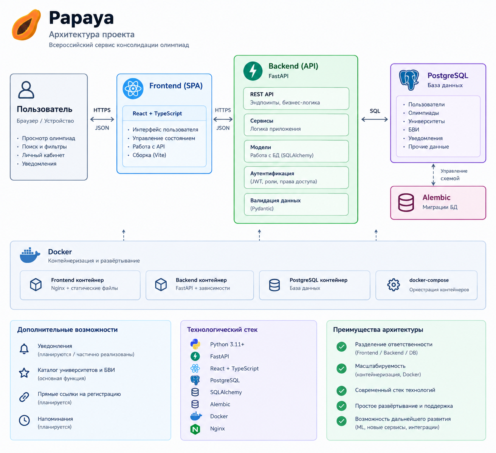

# Papaya

[](https://opensource.org/licenses/MIT)
[](https://www.python.org/)
[](https://www.docker.com/)

| 🌐 Язык |
|---------|
| [🇷🇺 Русский](README.md) • [🇬🇧 English](English.md) |

## Содержание

- [Краткое описание](#краткое-описание)
- [О проекте](#о-проекте)
- [Возможности](#возможности)
- [Архитектура](#архитектура)
- [Стек технологий](#стек-технологий)
- [Быстрый запуск](#быстрый-запуск)
- [API](#api)
- [Roadmap](#roadmap)
- [История изменений](#история-изменений)
- [Лицензия](#лицензия)

## Краткое описание

Papaya — веб-сервис, который собирает в одном месте информацию о всероссийских и региональных олимпиадах для школьников. Пользователь регистрируется, ведёт профиль и просматривает каталог олимпиадных событий; редакторы и администраторы наполняют каталог, в том числе массовым импортом из таблиц.

Проект решает проблему разрозненности: сведения об олимпиадах сейчас разбросаны по сайтам организаторов, и школьнику сложно составить полную картину — что проводится, когда и где регистрироваться. Papaya даёт единую точку входа.

## О проекте

Основная идея Papaya — единая система работы с олимпиадами вместо набора отдельных страниц.

На текущем этапе это веб-приложение с учётными записями и каталогом событий: пользователи видят актуальный список олимпиад, а редакторы и администраторы управляют содержимым и импортируют данные из PDF и XLSX-таблиц.

Долгосрочная цель — связать олимпиады с возможностями поступления, включая льготы (БВИ, 100 баллов) по конкретным университетам и образовательным программам. Эта функциональность **запланирована и пока не реализована** (см. [Roadmap](#roadmap)).

## Возможности

Реализовано в текущей ветке:

- регистрация, вход и выход (JWT в HttpOnly-cookies: `access_jwt` 10 минут, `refresh_jwt` 14 дней);
- профили пользователей и их редактирование (только владелец профиля);
- роли `USER`, `EDITOR`, `ADMIN`;
- каталог активных олимпиад и страница конкретного события;
- список «мои события»;
- создание и редактирование событий (`EDITOR` — только свои, `ADMIN` — любые);
- импорт событий из загружаемых таблиц **PDF** и **XLSX**;
- обработка PDF через **Tesseract OCR** в фоновой очереди **Celery**;
- автоматический подбор изображений события по названию (поиск картинок DuckDuckGo, отключается флагом `TABLE_IMPORT_IMAGES=false`);
- административная панель: списки пользователей и событий, блокировка/разблокировка, назначение и снятие роли `ADMIN`, архивация событий;
- кэширование списков и объектов в **Redis** с версионированием;
- healthcheck-маршруты: `GET /api/v1/health` (liveness) и `GET /api/v1/ready` (readiness) — проверяют доступность PostgreSQL и Redis;
- управление схемой БД через миграции **Alembic** (применяются автоматически при старте контейнера);
- автоматические API-тесты (`pytest` + `pytest-asyncio` + `httpx`).

Среда не запускается без Docker: PostgreSQL, Redis, веб-приложение, Celery и pgAdmin поднимаются контейнерами (`docker compose`).

**Уже реализовано:**

- рабочая аутентификация и ролевая модель;
- каталог событий с импортом из таблиц;
- администрирование пользователей и событий;
- фундамент для дальнейшего развития: миграции БД, конфигурация через переменные окружения, кэш в Redis, health/readiness-маршруты, автоматические тесты.

**В разработке (очередные шаги ветки):**

- производственное ужесточение: rate limiting, security headers, структурированные логи, полная документация API, проверка CORS/CSRF;
- закрепление тестов в CI.

**Запланировано:**

- доменная модель олимпиады (`Organizer`, `Olympiad`, `OlympiadEdition`, `Stage`, предметы, классы, регионы);
- публичный каталог с поиском и фильтрами;
- личный кабинет, избранное и персональные рекомендации;
- университеты и преимущества при поступлении (БВИ и др.);
- уведомления, календарь, модерация данных и автоматическое наполнение.

Полный план — в [docs/TODO.md](docs/TODO.md).

## Архитектура



Взаимодействие компонентов:

- **Frontend** — одностраничное приложение (vanilla JS без сборщика), подключается к API по `/api/v1` и работает с JWT-cookies.
- **Backend** — FastAPI (async): роутеры `auth`, `user`, `events`, `admin`, `health`; слой доступа к данным на async SQLAlchemy; Pydantic-схемы.
- **PostgreSQL** — основная БД; схема управляется миграциями Alembic (`migrations/versions`).
- **Redis** — версионный кэш списков и объектов, брокер и бэкенд Celery.
- **Celery** — очередь `heavy` для CPU-нагруженной обработки PDF (OCR).
- **OCR/импорт** — Tesseract OCR (русский и английский языки) + img2table для извлечения таблиц из PDF; XLSX обрабатывается напрямую через pandas/OpenPyXL.
- **Docker Compose** — сервисы `postgres`, `redis`, `web`, `celery`, `pgadmin`, а также профиль `testing` для запуска тестов.

## Стек технологий

- **Backend:** Python 3.11, FastAPI, Uvicorn, Gunicorn, Werkzeug (утилиты).
- **База данных:** PostgreSQL 16, SQLAlchemy 2 (async), asyncpg, Alembic.
- **Аутентификация:** PyJWT (JWT в cookies), bcrypt, Pydantic-валидация.
- **Кэш и фоновые задачи:** Redis 7, Celery 5.
- **Импорт и OCR:** Tesseract OCR, img2table, pandas, OpenPyXL, OpenCV (headless), PyTorch (CPU) — используются модулями извлечения таблиц.
- **Подбор изображений:** ddgs (поиск картинок DuckDuckGo).
- **Frontend:** HTML, CSS, Vanilla JS SPA, Tailwind CSS (CDN).
- **Тестирование:** pytest, pytest-asyncio, httpx, asgi-lifespan (dev-зависимости).
- **Контейнеризация и деплой:** Docker, Docker Compose, Render (`render.yaml`).

## Быстрый запуск

Нужны только Docker Desktop (или Docker Engine) и Docker Compose v2 — Python, PostgreSQL и другие зависимости ставятся в контейнерах автоматически.

```bash
git clone https://github.com/SHAMBALENOK/Papaya.git
cd Papaya
```

Если нужна своя конфигурация — скопируйте `.env.example` в `.env` и заполните значения:

```bash
cp .env.example .env
```

Ключевые переменные окружения (все подробности — в `.env.example`):

- `JWT_KEY` — секрет подписи JWT; в production длинная случайная строка (например, `python -c "import secrets; print(secrets.token_hex(32))"`);
- `ENVIRONMENT` — `development` (по умолчанию) или `production` (включает `Secure`-флаг cookie и запрещает секрет-заглушки);
- `DATABASE_URL` — подключение к PostgreSQL; миграции Alembic применяются автоматически при старте контейнера;
- `MAX_UPLOAD_MB` — максимальный размер загружаемой таблицы (по умолчанию `30`);
- `HF_TOKEN` — опционально, для загрузки AI-моделей с Hugging Face.

**Сборка и запуск:**

```bash
docker compose up --build -d
```

**После запуска доступны:**

- приложение — http://localhost:5000
- интерактивная документация API — http://localhost:5000/docs
- pgAdmin — http://localhost:5050 (логин `postgres@postgres.com`, пароль `postgres`; хост БД `postgres`, порт `5432`, база `postgres`)

**Просмотр логов:**

```bash
docker compose logs -f web celery
```

**Остановка (данные в Docker volumes сохраняются):**

```bash
docker compose down
```

**Полная очистка вместе с томами БД/Redis:**

```bash
docker compose down -v
```

> ⚠️ `down -v` безвозвратно удаляет базу данных и Redis. Загруженные в `app/tables` файлы находятся в каталоге проекта и не удаляются.

### Запуск тестов

API-тесты выполняются в изолированном контейнере профиля `testing` (рабочая БД не затрагивается: создаётся отдельная база `papaya_test`, накатываются миграции, Redis очищается):

```bash
docker compose --profile testing run --rm test
```

Запуск подмножества тестов (пример для Linux; для Windows PowerShell замените `\` на `` ` `` и `&&` на `; if ($?)`):

```bash
docker compose --profile testing run --rm test sh -c \
  "pip install --no-cache-dir -q -r /app/requirements-dev.txt && pytest -q -k 'roles or auth'"
```

## API

Все API-маршруты используют префикс `/api/v1`. Авторизация — JWT в HttpOnly-cookies (`access_jwt` и `refresh_jwt`), зашита от CSRF через `SameSite=Lax`; в production добавляется `Secure`.

После запуска приложения полная интерактивная документация (Swagger) доступна по адресу http://localhost:5000/docs — там автоматически собрана схема всех маршрутов, параметров и моделей ответов.

Особенности API:

- неизвестные пути под `/api/v1/` возвращают JSON 404, а не HTML-заглушку SPA;
- health-маршруты: `GET /api/v1/health` (liveness) и `GET /api/v1/ready` (readiness);
- объекты уровня «событие» и «профиль» кэшируются в Redis с инвалидацией по версиям.

## Roadmap

Полный поэтапный план (стабилизация → доменная модель олимпиад → каталог → поиск → личный кабинет → университеты и БВИ → рекомендации → наполнение базы → организаторы → навигатор поступления) ведётся в [docs/TODO.md](docs/TODO.md). README намеренно не содержит его копии, чтобы план не устаревал в двух местах.

## История изменений

**`patch-0.6`**

- добавлены health/readiness-маршруты и Docker healthcheck;
- аутентификация переведена на JWT в HttpOnly-cookies (`HttpOnly`, `SameSite=Lax`, `Secure` в production);
- подключён Alembic: миграции БД применяются автоматически при старте; legacy-базы корректно «пристыковываются» к базовой ревизии;
- конфигурация централизована и валидируется при старте, из репозитория удалён случайно попавший секрет;
- ужесточён API-контракт: серверные поля отделены от клиентских, ошибки отдают единый JSON-формат без утечки внутренних деталей;
- добавлена object-level авторизация: `EDITOR` правит только свои события, `ADMIN` — любые;
- добавлены автоматические API-тесты (pytest) для регистрации, авторизации, logout, CRUD событий, ролей и health-маршрутов;
- импорт таблиц защищён лимитом размера файла, учтены ограничения bcrypt (72 байта), дубли email обрабатываются как HTTP 409;
- версии зависимостей закреплены, базовый образ зафиксирован по digest для воспроизводимой сборки.

## Лицензия

Проект распространяется по лицензии [GNU GPL 0.3](LICENSE).
