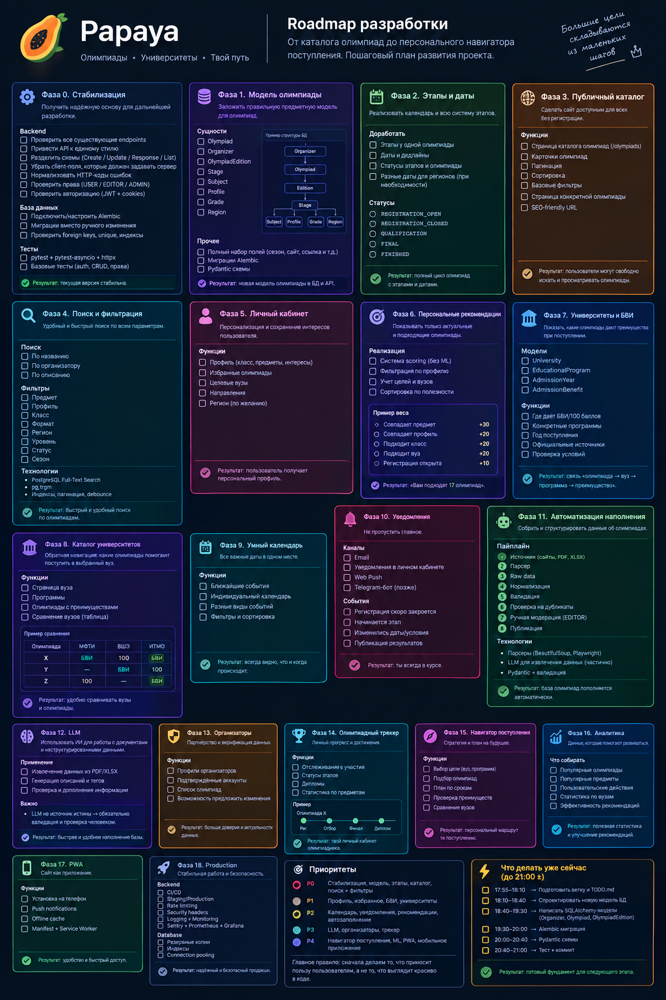

# 🥭 Papaya — Roadmap разработки



> Полный поэтапный план развития SHAMBALENOK/Papaya.
>
> **Главный принцип:** сначала сделать Papaya полезным каталогом олимпиад, затем превратить его в персональный навигатор по олимпиадам и поступлению.
>
> **Правило разработки:** не делать крупные архитектурные переделки без необходимости. Текущий стек уже достаточно серьёзный: FastAPI + async SQLAlchemy + PostgreSQL + SPA + JWT + Redis + Celery + Docker.

---

# Фаза 0 — Стабилизация текущего проекта

**Цель:** получить стабильную точку, от которой можно безопасно развивать функциональность.

## Backend
- [X] Проверить существующие endpoints.
- [X] Привести API к единому стилю.
- [X] Разделить schemas на `Create / Update / Response / List`.
- [X] Убрать из клиентских схем поля, которые должен задавать сервер.
- [X] Нормализовать HTTP-коды ошибок.
- [X] Проверить права `USER / EDITOR / ADMIN`.
- [X] Проверить JWT/cookie-аутентификацию.
- [X] Проверить обработку некорректных данных.

## Database
- [X] Подключить и настроить Alembic.
- [X] Все изменения БД проводить через миграции.
- [X] Проверить foreign keys.
- [X] Проверить unique constraints.
- [X] Добавить необходимые индексы.

## Tests
- [X] Настроить `pytest`.
- [X] Настроить `pytest-asyncio`.
- [X] Использовать `httpx` для API-тестов.
- [X] Тест регистрации.
- [X] Тест авторизации.
- [X] Тест logout.
- [X] Тест получения олимпиады.
- [X] Тест создания.
- [X] Тест изменения.
- [X] Тест удаления.
- [X] Тест проверки ролей.

**Результат:** существующий функционал стабилен и не ломается при дальнейшей разработке.

---

# Фаза 1 — Нормальная доменная модель олимпиады

**Цель:** перестать воспринимать олимпиаду как простой `Event`.

## Основные сущности
- [ ] `Olympiad`
- [ ] `Organizer`
- [ ] `OlympiadEdition`
- [ ] `Stage`
- [ ] `Subject`
- [ ] `Profile`
- [ ] `Grade`
- [ ] `Region`

## Концепция

```text
Organizer
    │
    ▼
Olympiad
    │
    └── Edition 2026/27
          ├── Registration
          ├── Qualification
          ├── Final
          └── Results
```

## Olympiad
- [ ] Название.
- [ ] Описание.
- [ ] Официальный сайт.
- [ ] Ссылка на регистрацию.
- [ ] Организатор.
- [ ] Предметы.
- [ ] Профили.
- [ ] Классы.
- [ ] Формат.
- [ ] Регион.
- [ ] Уровень.
- [ ] Статус.

## Technologies
- PostgreSQL
- SQLAlchemy Async
- Pydantic
- Alembic

**Не добавлять новые технологии без необходимости.**

---

# Фаза 2 — Этапы и даты

**Цель:** сделать временную структуру олимпиады.

Пример:

```text
Олимпиада X — 2026/27

Регистрация
01.09 — 15.10

Отборочный этап
20.10 — 05.11

Заключительный этап
15.03 — 30.03

Результаты
10.04
```

## Сделать
- [ ] Несколько этапов у одной олимпиады.
- [ ] Отдельные даты для каждого этапа.
- [ ] Дедлайны.
- [ ] Статус каждого этапа.
- [ ] Автоматическое вычисление текущего статуса олимпиады.

## Возможные статусы

```text
REGISTRATION_OPEN
REGISTRATION_CLOSED
QUALIFICATION
FINAL
RESULTS
FINISHED
```

---

# Фаза 3 — Публичный каталог олимпиад

**Цель:** Papaya должен быть полезен даже без регистрации.

## Сделать
- [ ] Публичная страница `/olympiads`.
- [ ] Карточки олимпиад.
- [ ] Пагинация.
- [ ] Сортировка.
- [ ] Фильтры.
- [ ] Страница конкретной олимпиады.
- [ ] SEO-friendly URL.

Пример:

```text
/olympiads/fiztekh
```

вместо:

```text
/events/173
```

## Карточка олимпиады

Показывать минимум:

- [ ] Название.
- [ ] Предмет.
- [ ] Классы.
- [ ] Статус.
- [ ] Ближайший дедлайн.
- [ ] Организатора.
- [ ] Ссылку на официальный сайт.
- [ ] Ссылку на регистрацию.

---

# Фаза 4 — Поиск и фильтрация

**Цель:** пользователь должен быстро находить нужную олимпиаду.

## Search
Искать по:
- [ ] Названию.
- [ ] Организатору.
- [ ] Описанию.

## Filters
- [ ] Предмет.
- [ ] Профиль.
- [ ] Класс.
- [ ] Формат.
- [ ] Регион.
- [ ] Уровень.
- [ ] Статус.
- [ ] Сезон.

## Technology

Для начала:

**PostgreSQL Full-Text Search + `pg_trgm`.**

Не использовать Elasticsearch/OpenSearch, пока реальный объём данных не потребует этого.

## Backend
- [ ] Пагинация.
- [ ] Сортировка.
- [ ] Индексы.
- [ ] Нормальные query parameters.

## Frontend
- [ ] Debounce поиска.
- [ ] Состояние фильтров в URL.
- [ ] Сохранение фильтров при навигации.

---

# Фаза 5 — Категории и теги

**Цель:** сделать навигацию по тематике.

## Categories / Subjects
- [ ] Математика.
- [ ] Физика.
- [ ] Информатика.
- [ ] Химия.
- [ ] Биология.
- [ ] И т. д.

## Tags
Например:

```text
#программирование
#AI
#робототехника
#экономика
#для10класса
```

## Database
- [ ] `subjects`
- [ ] `tags`
- [ ] `olympiad_subjects`
- [ ] `olympiad_tags`

---

# Фаза 6 — Личный кабинет школьника

**Цель:** создать причину регистрироваться на Papaya.

## Профиль
- [ ] Класс.
- [ ] Предметы.
- [ ] Профили.
- [ ] Регион.
- [ ] Целевые университеты.
- [ ] Интересующие направления.

## Избранное
- [ ] Добавление олимпиады в избранное.
- [ ] Удаление.
- [ ] Страница избранного.
- [ ] Сортировка избранного.

## Мои олимпиады
- [ ] Список отслеживаемых олимпиад.
- [ ] Статус участия.

---

# Фаза 7 — Персональные рекомендации

**Цель:** показать пользователю олимпиады, которые подходят именно ему.

## Первый вариант — без ML

Использовать scoring:

```text
Совпадает предмет       +30
Совпадает профиль       +20
Подходит класс          +20
Подходит выбранный вуз  +20
Регистрация открыта     +10
Подходит регион          +5
```

Получаем:

```text
Физтех          92
Высшая проба    88
Ломоносов        81
НТО              77
```

## Сделать
- [ ] Recommendation service.
- [ ] Расчёт score.
- [ ] Объяснение рекомендации пользователю.
- [ ] Сортировку по релевантности.
- [ ] Блок «Подходит вам».

## ML пока не нужен.

---

# Фаза 8 — Университеты и БВИ

**Цель:** одна из главных уникальных функций Papaya.

## Новые сущности
- [ ] `University`
- [ ] `EducationalProgram`
- [ ] `AdmissionYear`
- [ ] `AdmissionBenefit`

## Модель

```text
Olympiad
    ↓
Result / Diploma
    ↓
AdmissionBenefit
    ↓
University
    ↓
EducationalProgram
    ↓
AdmissionYear
```

## Для преимущества хранить
- [ ] Университет.
- [ ] Конкретную программу.
- [ ] Год поступления.
- [ ] Тип преимущества.
- [ ] Условия.
- [ ] Официальный источник.
- [ ] Дату проверки.

## Типы
- [ ] БВИ.
- [ ] 100 баллов.
- [ ] Дополнительные баллы.
- [ ] Другие преимущества.

**Важно:** не писать просто «Олимпиада X даёт БВИ». Условия зависят от вуза, программы, года и результата.

---

# Фаза 9 — Каталог университетов

**Цель:** сделать обратный поиск.

Пользователь открывает университет и видит:

```text
МФТИ
│
├── Программы
│
└── Олимпиады, дающие преимущества
```

## Сделать
- [ ] Страница университета.
- [ ] Страница программы.
- [ ] Список олимпиад.
- [ ] Фильтр по году поступления.
- [ ] Сравнение университетов.

## Сравнение

```text
                         МФТИ    ВШЭ    ИТМО

Олимпиада X               БВИ     100    БВИ
Олимпиада Y               —       БВИ    100
Олимпиада Z               100     —      БВИ
```

---

# Фаза 10 — Умный календарь

**Цель:** собрать все даты пользователя в одном месте.

## Сделать
- [ ] Календарь олимпиад.
- [ ] Ближайшие события.
- [ ] Дедлайны.
- [ ] Начало этапов.
- [ ] Конец этапов.
- [ ] Фильтр по избранным олимпиадам.
- [ ] Персональный календарь.

## Backend
Использовать существующие PostgreSQL + Celery + Redis.

---

# Фаза 11 — Уведомления

**Цель:** не дать пользователю забыть про олимпиаду.

## События
- [ ] Регистрация скоро закончится.
- [ ] Этап начинается завтра.
- [ ] Изменились даты.
- [ ] Изменились условия.
- [ ] Опубликованы результаты.
- [ ] Изменились условия поступления.

## Каналы
### Сначала
- [ ] Email.
- [ ] Уведомления внутри сайта.

### Потом
- [ ] Web Push.
- [ ] Telegram Bot.

## Technologies
- Celery
- Redis
- Email provider
- Web Push API
- Telegram Bot API

---

# Фаза 12 — Автоматическое наполнение базы

**Цель:** масштабировать количество олимпиад без ручного ввода каждой записи.

## Pipeline

```text
Источник
   ↓
Parser
   ↓
Raw data
   ↓
Normalizer
   ↓
Validator
   ↓
Duplicate detection
   ↓
Human review
   ↓
Published
```

## Источники
- [ ] Сайты организаторов.
- [ ] Официальные документы.
- [ ] PDF.
- [ ] XLSX.
- [ ] Страницы университетов.

## Хранить источник
- [ ] `source_url`
- [ ] `source_name`
- [ ] `retrieved_at`
- [ ] `verified_at`

---

# Фаза 13 — AI/LLM для обработки документов

**Цель:** использовать AI там, где он действительно экономит время.

LLM не должна быть источником истины.

## Pipeline

```text
PDF / Web page
      ↓
LLM extraction
      ↓
Structured draft
      ↓
Pydantic validation
      ↓
Business rules
      ↓
EDITOR review
      ↓
Database
```

## Пример

Из текста:

> Олимпиада проводится среди учащихся 8–11 классов.

Получить:

```json
{
  "grades": [8, 9, 10, 11]
}
```

## Использовать AI для
- [ ] Извлечения дат.
- [ ] Определения классов.
- [ ] Определения предметов.
- [ ] Извлечения условий.
- [ ] Нормализации названий.
- [ ] Поиска потенциальных дублей.

## Не доверять LLM автоматически
- [ ] Финальным датам.
- [ ] БВИ.
- [ ] Юридически значимым условиям.
- [ ] Официальным фактам без проверки.

---

# Фаза 14 — Модерация и качество данных

**Цель:** сделать базу достоверной.

## Статусы
```text
DRAFT
PENDING_REVIEW
PUBLISHED
ARCHIVED
```

## Сделать
- [ ] Предложение исправления пользователем.
- [ ] Очередь модерации.
- [ ] Проверку редактором.
- [ ] Историю изменений.
- [ ] Audit log.
- [ ] Отображение источника.
- [ ] Дату последней проверки.

---

# Фаза 15 — Организаторы

**Цель:** перейти от агрегатора к платформе, с которой могут сотрудничать организаторы.

## Organizer profile
- [ ] Название.
- [ ] Описание.
- [ ] Официальный сайт.
- [ ] Контакты.
- [ ] Список олимпиад.

## Верификация
- [ ] Подтверждённый организатор.
- [ ] Проверка представителя.
- [ ] Значок verified.

## Взаимодействие
- [ ] Организатор может предложить обновление.
- [ ] Организатор может подтверждать информацию.
- [ ] Прямая ссылка на регистрацию.
- [ ] Официальные интеграции.

---

# Фаза 16 — Олимпиадный трекер

**Цель:** превратить Papaya в личный менеджер олимпиад.

Пример:

```text
Физтех

☑ Зарегистрирован
☑ Прошёл отбор
☐ Финал
☐ Диплом
```

## Сделать
- [ ] Статусы участия.
- [ ] Изменение статуса.
- [ ] История участия.
- [ ] Личные результаты.
- [ ] Дипломы.
- [ ] Привязка результата к преимуществам.

---

# Фаза 17 — Статистика пользователя

## Показатели
- [ ] Количество участий.
- [ ] Количество финалов.
- [ ] Количество дипломов.
- [ ] Разбивка по предметам.
- [ ] Разбивка по годам.
- [ ] История прогресса.

---

# Фаза 18 — «Мой путь к поступлению»

**Главная долгосрочная идея Papaya.**

Пользователь задаёт:

```text
Класс: 11
Цель: МФТИ
Направление: IT
Предметы: математика + информатика
```

Papaya строит:

```text
Сентябрь
→ Олимпиада X
→ Олимпиада Y

Октябрь
→ Отбор X

Ноябрь
→ Отбор Y

Март
→ Финал X

Апрель
→ Проверка результатов
```

И показывает:

> Какие олимпиады могут помочь при поступлении на выбранные программы.

## Сделать
- [ ] Целевые университеты.
- [ ] Целевые программы.
- [ ] План участия.
- [ ] Дедлайны.
- [ ] Возможные преимущества.
- [ ] Напоминания.
- [ ] Прогресс выполнения.

---

# Фаза 19 — Аналитика

После появления реальных пользователей:

- [ ] Самые популярные олимпиады.
- [ ] Самые популярные предметы.
- [ ] Частота поисковых запросов.
- [ ] Популярные университеты.
- [ ] Конверсия просмотра → регистрация.
- [ ] Избранное.
- [ ] Уведомления.
- [ ] Популярные рекомендации.

Эти данные позже можно использовать для ML-рекомендаций.

---

# Фаза 20 — ML-рекомендации

**Только после накопления данных.**

Не обучать модель на пустом сайте.

Возможные данные:

```text
пользователь
    ↓
поиск
    ↓
просмотр
    ↓
избранное
    ↓
регистрация
    ↓
участие
```

На основе этого можно обучать персональную recommendation system.

---

# Фаза 21 — PWA

После стабилизации веб-версии:

- [ ] Web App Manifest.
- [ ] Service Worker.
- [ ] Offline shell.
- [ ] Web Push.
- [ ] Иконка.
- [ ] Установка на Android.

Отдельное мобильное приложение пока не требуется.

---

# Фаза 22 — Frontend 2.0

Текущий vanilla JS SPA можно оставить, пока он не становится реальным ограничением.

Когда количество интерфейсной логики сильно вырастет:

- [ ] Vite.
- [ ] TypeScript.
- [ ] React или другой framework.
- [ ] Компонентная архитектура.
- [ ] Типизированный API client.
- [ ] Нормальная система состояния.

**Не делать эту миграцию заранее.**

---

# Фаза 23 — Production hardening

## Backend
- [ ] Rate limiting.
- [ ] Security headers.
- [ ] Structured logging.
- [X] Healthcheck.
- [X] Нормальные error responses.
- [ ] API documentation.
- [ ] Проверка CORS/CSRF.

## Database
- [ ] Индексы.
- [ ] Constraints.
- [ ] Connection pooling.
- [ ] Backup.
- [ ] Проверка восстановления из backup.

## Infrastructure
- [ ] Docker.
- [ ] CI/CD.
- [ ] Staging.
- [ ] Production.
- [ ] Мониторинг.

## Monitoring
- [ ] Sentry.
- [ ] Метрики.
- [ ] Логи.
- [ ] Алерты.

Prometheus + Grafana — только если масштаб действительно этого потребует.

---

# 🎯 Приоритеты

## 🔴 P0 — сначала
- [ ] Стабилизация.
- [ ] Tests.
- [ ] Alembic.
- [ ] Новая модель олимпиады.
- [ ] Edition.
- [ ] Stage.
- [ ] Даты.
- [ ] Публичный каталог.
- [ ] Поиск.
- [ ] Фильтры.

## 🟠 P1 — ядро продукта
- [ ] Личный кабинет.
- [ ] Избранное.
- [ ] Университеты.
- [ ] Образовательные программы.
- [ ] БВИ.
- [ ] Другие преимущества.
- [ ] Источники и верификация.

## 🟡 P2 — удержание пользователей
- [ ] Календарь.
- [ ] Уведомления.
- [ ] Персональные рекомендации.
- [ ] Автоматическое наполнение.
- [ ] Предложения исправлений.

## 🟢 P3 — масштабирование
- [ ] Организаторы.
- [ ] Подтверждённые организации.
- [ ] AI extraction.
- [ ] Олимпиадный трекер.
- [ ] Статистика.

## 🔵 P4 — долгосрочные функции
- [ ] Навигатор поступления.
- [ ] ML-рекомендации.
- [ ] PWA.
- [ ] Frontend 2.0.
- [ ] Production hardening.

---

# 🚀 Ближайший спринт

## Sprint 1 — Olympiad Domain Model

- [ ] Создать ветку `feature/olympiad-model`.
- [ ] Создать `ROADMAP.md`.
- [ ] Спроектировать ER-модель.
- [ ] Создать `Organizer`.
- [ ] Создать `Olympiad`.
- [ ] Создать `OlympiadEdition`.
- [ ] Создать Alembic migration.
- [ ] Создать Pydantic schemas.
- [ ] Создать базовые endpoints.
- [ ] Написать тесты.
- [ ] Подключить модели к существующему API.
- [ ] Сделать первый реальный пользовательский экран на новой модели.

### Главное правило Sprint 1

**Не переписывать архитектуру ради архитектуры.**

После этого спринта должен существовать новый рабочий объект `Olympiad`, который можно создать через API, сохранить в PostgreSQL, получить обратно и показать пользователю.

---

# 🕘 Минимальная задача на один вечер

Если времени около 3 часов:

### 17:55–18:10
- [ ] Создать ветку.
- [ ] Создать `ROADMAP.md`.
- [ ] Зафиксировать задачу.

### 18:10–18:40
- [ ] Нарисовать ER-модель.
- [ ] Определить связи `Organizer → Olympiad → Edition`.

### 18:40–19:30
- [ ] Создать SQLAlchemy models:
  - [ ] `Organizer`
  - [ ] `Olympiad`
  - [ ] `OlympiadEdition`

### 19:30–20:00
- [ ] Создать Alembic migration.
- [ ] Проверить upgrade/downgrade.

### 20:00–20:40
- [ ] Создать Pydantic schemas.

### 20:40–21:00
- [ ] Написать 1–3 теста.
- [ ] Сделать commit.

## Цель к 21:00

```text
☑ Новая ветка
☑ ROADMAP.md
☑ Спроектирована модель
☑ Organizer
☑ Olympiad
☑ OlympiadEdition
☑ Alembic migration
☑ Pydantic schemas
☑ Тесты
☑ Commit
```

**Не пытаться сегодня сделать поиск, БВИ или календарь.**

---

# 🧭 Главная стратегия проекта

```text
Стабильный backend
        ↓
Нормальная модель олимпиад
        ↓
Публичный каталог
        ↓
Поиск и фильтры
        ↓
Пользовательский профиль
        ↓
Университеты + БВИ
        ↓
Календарь + уведомления
        ↓
Персональные рекомендации
        ↓
Автоматическое наполнение
        ↓
AI
        ↓
Организаторы
        ↓
Навигатор поступления
        ↓
ML
```

### Конечная идея

Papaya должен пройти путь:

**«Сайт со списком олимпиад»**

→ **«Удобный агрегатор олимпиад»**

→ **«База олимпиад + университетов + преимуществ»**

→ **«Персональный помощник олимпиадника»**

→ **«Навигатор по поступлению через олимпиады».**
